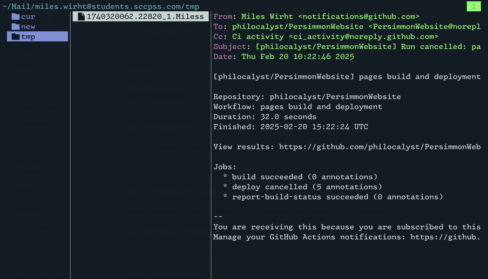

# Welcome!

**Mu Email Viewer Plugin for yazi**

This plugin provides email previewing capabilities within the [yazi](https://yazi-rs.github.io/) file manager. It leverages the power of [mu](https://www.djcbsoftware.nl/code/mu/) (a mail user agent) and [lynx](https://lynx.invisible-island.net/) (a text-based web browser) to render email content in a readable format directly in your terminal.



**NOTE**
Pagiation is still a work-in-progress (for some reason)
So no scrolling, yet. Feel free to submit a PR!

## Features

  - **Email Previewing:**  View email files directly within yazi without needing to open a separate email client.
  - **Plain Text and HTML Support:** Renders both plain text and HTML emails. For HTML emails, [lynx](https://lynx.invisible-island.net/) is used to convert HTML to plain text for terminal readability.
  - **Dependency Checks:** Automatically checks if `mu` and `lynx` are installed and notifies you if any dependencies are missing.
  - **Formatted Output:**  Uses `mu view` to extract and format email content, and `lynx` to process HTML for clean terminal rendering.

## Usage
**Add these lines to your yazi.toml:**
```lua
prepend_previewers = [
	{ mime = "application/mail", run = "mu-view" },
	{ mime = "message/rfc822", run = "mu-view" },
]
```

## Installation
*Please ensure all required dependencies are on your path before using this plugin*

### Recommended:
`ya pack -a philocalyst/mu-view`

### General:

1.  **Navigate to your yazi plugin directory.**  This is typically located at `~/.config/yazi/plugins/`

    ```bash
    mkdir -p ~/.config/yazi/plugins
    cd ~/.config/yazi/plugins
    ```

2.  **Download the plugin files.** You can either download it directly or create a file named `main.lua` and copy the Lua code from this repository into it.

    ```bash
    gh repo clone philocalyst/mu-view.yazi
    ```

3.  **Restart yazi.**  The plugin should now be automatically loaded when you preview an email file.

## Dependencies

This plugin requires the following command-line tools to be installed and available in your `$PATH`:

  **NOTE** Installation methosd have not been vetted by me and may be inconsistent with expectations.


  - **mu (Mail User Agent):**

      - Used for parsing and extracting content from email files.

      - Installation instructions vary depending on your operating system.  Here are some common methods:

        **Debian/Ubuntu:**

        ```bash
        sudo apt update
        sudo apt install mu
        ```

        **Fedora/CentOS/RHEL:**

        ```bash
        sudo yum install mu # (CentOS/RHEL)
        sudo dnf install mu # (Fedora)
        ```

        **Arch Linux:**

        ```bash
        sudo pacman -S mu
        ```

        **macOS (using Homebrew):**

        ```bash
        brew install mu
        ```

      - Refer to the [mu repo](https://github.com/djcb/mu) for more detailed installation instructions for your specific system.

  - **lynx (Text-based Web Browser):**

      - Used to render HTML email content into plain text for terminal display.

      - Installation instructions:

        **Debian/Ubuntu:**

        ```bash
        sudo apt update
        sudo apt install lynx
        ```

        **Fedora/CentOS/RHEL:**

        ```bash
        sudo yum install lynx # (CentOS/RHEL)
        sudo dnf install lynx # (Fedora)
        ```

        **Arch Linux:**

        ```bash
        sudo pacman -S lynx
        ```

        **macOS (using Homebrew):**

        ```bash
        brew install lynx
        ```


## Usage

Once installed and with dependencies met, the `mu-view` plugin will automatically activate when you preview email files within yazi. 

The plugin will attempt to render the email content in a readable plain text format. If the email is in HTML format, it will use `lynx` to convert it to plain text before displaying it.

If `mu` or `lynx` are not installed or not found in your `$PATH`, unexpected behavior will occur.

## Configuration

Currently, the plugin has a basic configuration option for tab size:

```lua
local PREVIEW = {
    tab_size = 4 -- Adjust tab spacing in previews
}
```

You can modify the `tab_size` value in the `main.lua` file to change the number of spaces used to represent tabs in the previewed email content.

## License

This plugin is released under the MIT License
